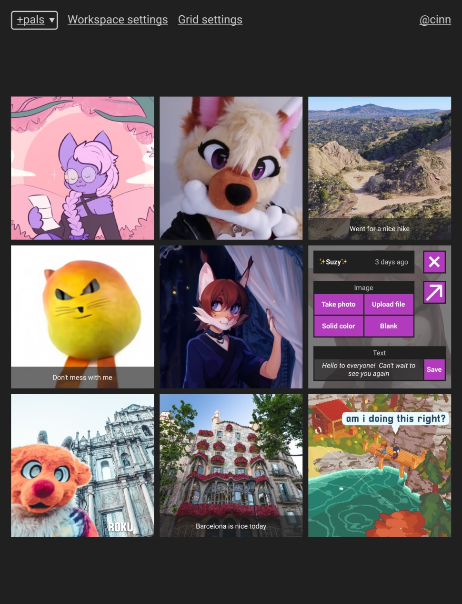

# Wafflegram

**Very WIP!**

This is also serving as a development space for "declarative layers" in Earthstar.

## What it will be

An [Earthstar](https://github.com/earthstar-project/earthstar) app.

A grid that you and your friends can put images into.

This is meant as an ambient display, like a digital photo frame collaboratively filled by you and your friends.

The grid is a fixed size and layout, typically 3x3, but adjustable.  It always scales to fill the window with no cropping.

Anyone can put images in any cell of the grid.  Images are always square.

You can modify any cell at any time by overwriting it with a new image.  Old images are not kept; the patchwork evolves over time.

Each cell can also have a text caption.

You can maximize a cell to fill the screen.  This is useful if you're building an actual grid of physical devices like old iPads.

## Mockup

In this mockup the center-right cell is showing its "options" view -- this is how you modify a cell.

Images from random places around the web, sorry for lazy lack of copyright information gathering, I will replace with with a better mockup soon.



## How to use it

## What's Earthstar?

## Inviting people; Privacy details

## Tech details: this app

## Tech details related to Earthstar

At first there will only be one grid in a workspace.  Later we may allow more than one.

Document paths:
```
    /wafflegram-v1/grid:main/settings.json
    /wafflegram-v1/grid:main/cell:1:1/image.jpg
    /wafflegram-v1/grid:main/cell:1:1/caption.txt
```

Images will be resized to small square low quality JPGs to keep the size under 100kb.  They will be stored as base64 in Earthstar.

---
---
---
---
---
---

# Getting Started with Create React App

This project was bootstrapped with [Create React App](https://github.com/facebook/create-react-app).

## Available Scripts

In the project directory, you can run:

### `yarn start`

Runs the app in the development mode.\
Open [http://localhost:3000](http://localhost:3000) to view it in the browser.

The page will reload if you make edits.\
You will also see any lint errors in the console.

### `yarn test`

Launches the test runner in the interactive watch mode.\
See the section about [running tests](https://facebook.github.io/create-react-app/docs/running-tests) for more information.

### `yarn build`

Builds the app for production to the `build` folder.\
It correctly bundles React in production mode and optimizes the build for the best performance.

The build is minified and the filenames include the hashes.\
Your app is ready to be deployed!

See the section about [deployment](https://facebook.github.io/create-react-app/docs/deployment) for more information.

### `yarn eject`

**Note: this is a one-way operation. Once you `eject`, you can’t go back!**

If you aren’t satisfied with the build tool and configuration choices, you can `eject` at any time. This command will remove the single build dependency from your project.

Instead, it will copy all the configuration files and the transitive dependencies (webpack, Babel, ESLint, etc) right into your project so you have full control over them. All of the commands except `eject` will still work, but they will point to the copied scripts so you can tweak them. At this point you’re on your own.

You don’t have to ever use `eject`. The curated feature set is suitable for small and middle deployments, and you shouldn’t feel obligated to use this feature. However we understand that this tool wouldn’t be useful if you couldn’t customize it when you are ready for it.

## Learn More

You can learn more in the [Create React App documentation](https://facebook.github.io/create-react-app/docs/getting-started).

To learn React, check out the [React documentation](https://reactjs.org/).
